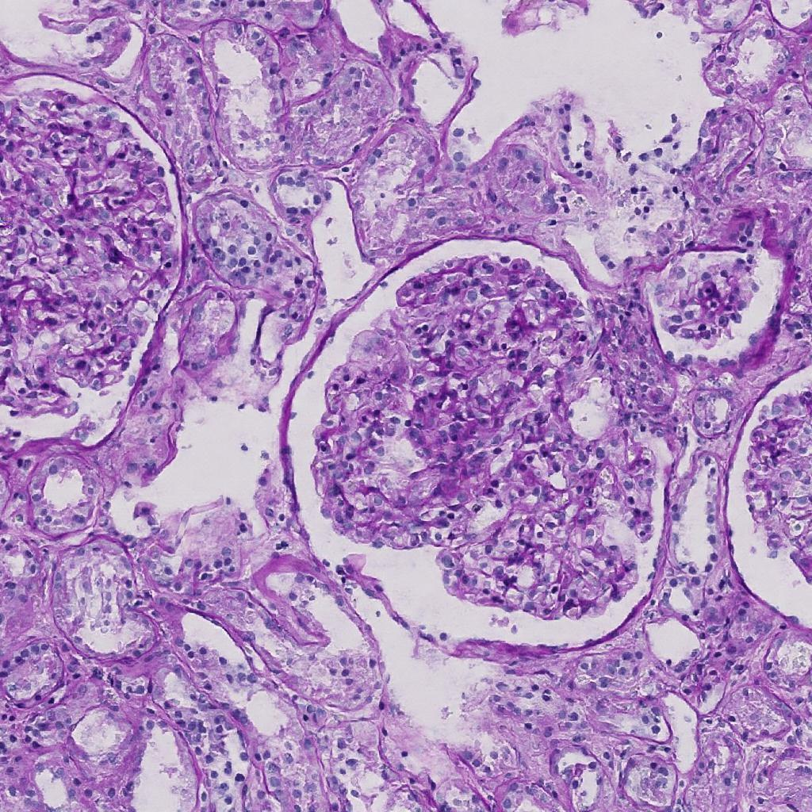
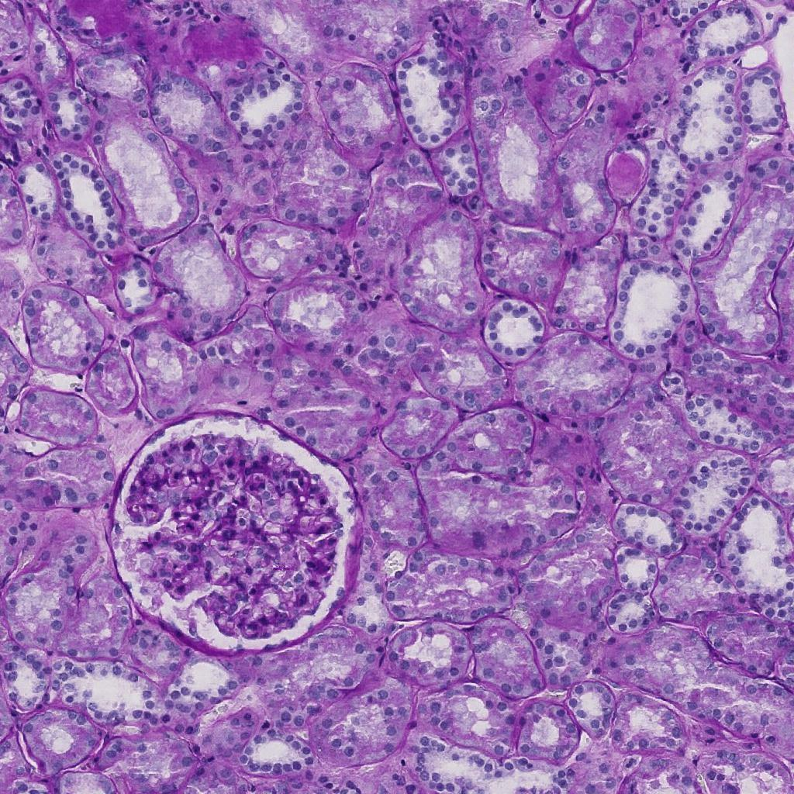
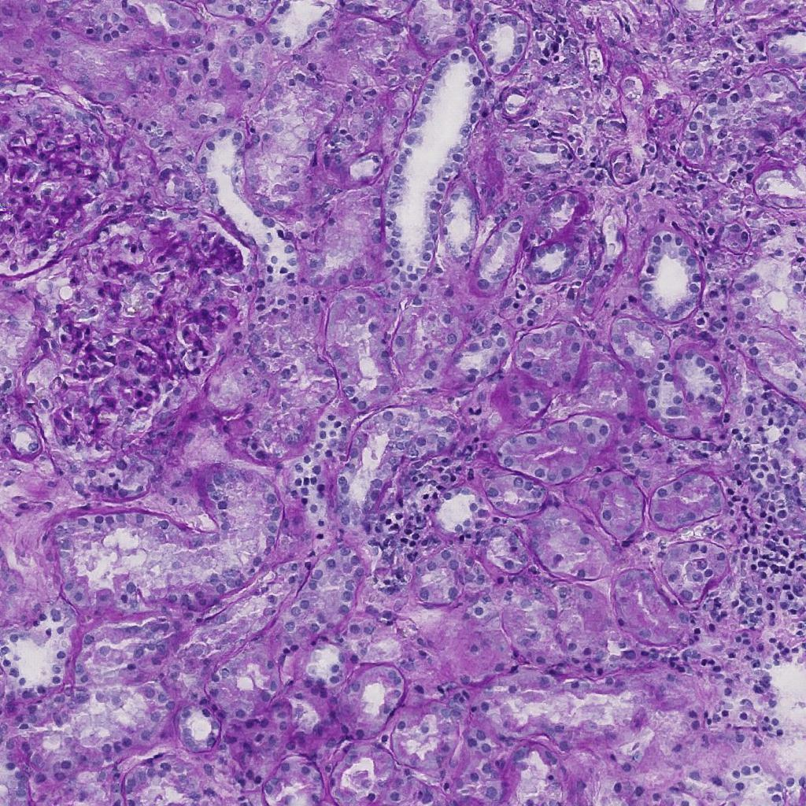

<br><br><br><br>

# Generating Synthetic Kidney FTU Images using Pix2PixHD
### [Project](https://github.com/Akshace/pix2pixHD-1) <br>

The PyTorch implementation of the original [code](https://https://github.com/NVIDIA/pix2pixHD) is used to generate high resolution synthetic images of Kidney glomeruli using semantic label maps and Edge images as inputs.
<!-- Pytorch implementation of our method for high-resolution (e.g. 2048x1024) photorealistic image-to-image translation. It can be used for turning semantic label maps into photo-realistic images or synthesizing portraits from face label maps. <br><br> -->
[High-Resolution Image Synthesis and Semantic Manipulation with Conditional GANs](https://tcwang0509.github.io/pix2pixHD/)  
<!--  [Ting-Chun Wang](https://tcwang0509.github.io/)<sup>1</sup>, [Ming-Yu Liu](http://mingyuliu.net/)<sup>1</sup>, [Jun-Yan Zhu](http://people.eecs.berkeley.edu/~junyanz/)<sup>2</sup>, Andrew Tao<sup>1</sup>, [Jan Kautz](http://jankautz.com/)<sup>1</sup>, [Bryan Catanzaro](http://catanzaro.name/)<sup>1</sup>  
 <sup>1</sup>NVIDIA Corporation, <sup>2</sup>UC Berkeley  
 In CVPR 2018.   -->

## Generated Synthetic Images from the Model
- Some Generated Results
<p align='center'>  
  
  
  
</p>
- Interactive editing results
<p align='center'>  
  
  
</p>
- Additional streetview results
<p align='center'>
  
  
</p>
<p align='center'>
  
  
</p>

- Label-to-face and interactive editing results
<p align='center'>
  
  
  
</p>
<p align='center'>
  
  
  
</p>

- Our editing interface
<p align='center'>
  
  
</p>

## Prerequisites
- Linux or macOS
- Python 2 or 3
- NVIDIA GPU (11G memory or larger) + CUDA cuDNN

## Getting Started
### Installation
- Install PyTorch and dependencies from http://pytorch.org
- Install python libraries [dominate](https://github.com/Knio/dominate).
```bash
pip install dominate
```
- Clone this repo:
```bash
git clone https://github.com/Akshace/pix2pixHD-1
cd pix2pixHD-1
```


### Testing
- A few example Kidney  images are included in the `datasets` folder.
- Please download the pre-trained generator model from [here](https://drive.google.com/file/d/1h9SykUnuZul7J3Nbms2QGH1wa85nbN2-/view?usp=sharing) (google drive link), and put it under `./checkpoints/FFPE_fp16/`
- Test the model:
```bash
python test.py --dataroot ./datasets/FFPE_fp16 --name FFPE_fp16 --netG global --resize_or_crop none --checkpoints_dir ./trained
```
The test results will be saved to a html file here: `./results/FFPE_fp16/test_latest/index.html`.

More example scripts can be found in the `scripts` directory.


### Dataset
- I used the Kidney Glomeruli dataset. 
- Link to the Dataset: https://www.kaggle.com/iafoss/hubmap-1024x1024
<!-- - 
- To train a model on the full dataset, please download it from the [official website](https://www.cityscapes-dataset.com/) (registration required).
After downloading, please put it under the `datasets` folder in the same way the example images are provided. -->


### Training
- Train a model at 1024 x 1024 resolution :
```bash
python train.py --name FFPE_fp16 --dataroot ./datasets/FFPE_fp16 --save_epoch_freq 10
```
- To view training results, please checkout intermediate results in `./checkpoints/FFPE_fp16/web/index.html`.
If you have tensorflow installed, you can see tensorboard logs in `./checkpoints/FFPE_fp16/logs` by adding `--tf_log` to the training scripts.

### Multi-GPU training
- Train a model using multiple GPUs :
```bash

python train.py --name FFPE_fp16 --dataroot ./datasets/FFPE_fp16 --save_epoch_freq 10 --batchSize 4 --gpu_ids 0,1,2,3
```
Note: I have tested trainig this model using 4 Tesla V100 GPUs, and it reduced training time by 40%

<!-- ### Training with Automatic Mixed Precision (AMP) for faster speed
- To train with mixed precision support, please first install apex from: https://github.com/NVIDIA/apex
- You can then train the model by adding `--fp16`. For example,
```bash
#!./scripts/train_512p_fp16.sh
python -m torch.distributed.launch train.py --name label2city_512p --fp16
```
In our test case, it trains about 80% faster with AMP on a Volta machine.

### Training at full resolution
- To train the images at full resolution (2048 x 1024) requires a GPU with 24G memory (`bash ./scripts/train_1024p_24G.sh`), or 16G memory if using mixed precision (AMP).
- If only GPUs with 12G memory are available, please use the 12G script (`bash ./scripts/train_1024p_12G.sh`), which will crop the images during training. Performance is not guaranteed using this script. -->

### Training with your own dataset
- If you want to train with your own dataset, please generate label maps which are one-channel whose pixel values correspond to the object labels (i.e. 0,1,...,N-1, where N is the number of labels). This is because we need to generate one-hot vectors from the label maps. Please also specity `--label_nc N` during both training and testing.
- If your input is not a label map, please just specify `--label_nc 0` which will directly use the RGB colors as input. The folders should then be named `train_A`, `train_B` instead of `train_label`, `train_img`, where the goal is to translate images from A to B.
- If you don't have instance maps or don't want to use them, please specify `--no_instance`.
- The default setting for preprocessing is `scale_width`, which will scale the width of all training images to `opt.loadSize` (1024) while keeping the aspect ratio. If you want a different setting, please change it by using the `--resize_or_crop` option. For example, `scale_width_and_crop` first resizes the image to have width `opt.loadSize` and then does random cropping of size `(opt.fineSize, opt.fineSize)`. `crop` skips the resizing step and only performs random cropping. If you don't want any preprocessing, please specify `none`, which will do nothing other than making sure the image is divisible by 32.

## More Training/Test Details
- Flags: see `options/train_options.py` and `options/base_options.py` for all the training flags; see `options/test_options.py` and `options/base_options.py` for all the test flags.
- Instance map: we take in both label maps and instance maps as input. If you don't want to use instance maps, please specify the flag `--no_instance`.


## Citation


```
@inproceedings{wang2018pix2pixHD,
  title={High-Resolution Image Synthesis and Semantic Manipulation with Conditional GANs},
  author={Ting-Chun Wang and Ming-Yu Liu and Jun-Yan Zhu and Andrew Tao and Jan Kautz and Bryan Catanzaro},  
  booktitle={Proceedings of the IEEE Conference on Computer Vision and Pattern Recognition},
  year={2018}
}
```

## Acknowledgments
This code borrows heavily from [pytorch-CycleGAN-and-pix2pix](https://github.com/junyanz/pytorch-CycleGAN-and-pix2pix).
